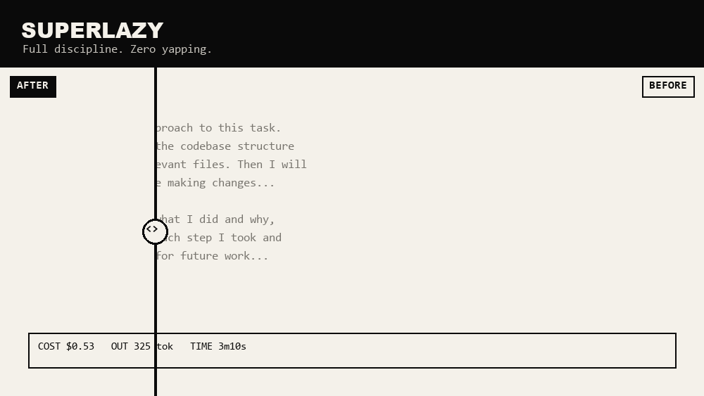

# 🦥 superlazy

  

Your AI writes essays about your code. You read none of them. You pay for all of them.

**superlazy** = 13 Claude Code skills + 1 hook. Full discipline (TDD, root-cause debugging, verification), zero narration. Distilled from [superpowers](https://github.com/obra/superpowers) + [anthropics/skills](https://github.com/anthropics/skills), then starved of tokens until only the useful parts survived.

<p align="center">
  
</p>

## Measured, not imagined

One real A/B run ([full methodology + caveats](BENCHMARK.md)): identical project, 3 planted bugs + 2 feature rounds, identical prompts, Sonnet 5.

| | 😩 baseline | 🦥 superlazy |
|---|---|---|
| session cost | $0.98 * | **$0.53** |
| output tokens | 745 * | **325** |
| API time | 3m 10s | **1m 15s** |
| tests at the end | — * | **11/11 pass** |
| bug #3 (root cause far from symptom) | — * | fixed **at the source**, not patched at the crash site |
| response you read | plans, progress, summaries | `✅` per round |

\* baseline run went sideways (edited the wrong directory) — its cost/tokens are indicative, not a fair comparison yet. Rerun pending. We put the asterisk here instead of pretending; see [BENCHMARK.md](BENCHMARK.md).

## What it saves — and what it doesn't

- ✅ **Output tokens** (the narration you never read) — the core skill's job. Roughly half in the run above, not 400×.
- ✅ **Input/context tokens, but only for large docs read in part** — `superlazy-context` (adapted from [supercontexter](https://github.com/StarchyBomb/supercontexter)) indexes a big file once and retrieves exact sections on demand instead of pasting it whole. Doesn't touch your repo's source files — if your agent re-reads those every turn, that's still your bill's biggest line.
- ❌ **Thinking tokens** — billed in full whether or not anything is printed. A silent model still thinks at full price.

Lazy, not dishonest.

## Install

```
/plugin marketplace add StarchyBomb/superlazy
```
```
/plugin install superlazy@superlazy
```

That's the whole tutorial. Manual people: clone and dump `skills/*` into `~/.claude/skills/`.

## What's inside

`superlazy` (the vow of silence) · `-tdd` · `-debug` · `-plan` · `-review` · `-verify` · `-worktree` · `-subagents` · `-skill-creator` · `-mcp` · `-context` (index + on-demand retrieval for large docs) · `-repomap` (one-shot codebase signature index) · `ultralazy` (all of the above stacked)

Each one: output ≤3 lines — blocking questions, stuff only you can do, and a final `✅`/`❌`. Everything else is `git diff`'s job.

## Not just prompts

Two pieces of this aren't skill text hoping the model remembers — they're code that runs:
- **`hooks/hooks.json`** — a `PreToolUse` hook that hard-blocks a `Read` of a file this session already read in full, unchanged on disk since. Active automatically once the plugin is installed, not something you have to invoke.
- **`skills/superlazy-verify/scripts/summarize.py`** — wraps a test/build command and filters long output to pass/fail lines + failure context, exit code intact.

## What a skill can't touch

Real cost levers exist outside what a skill's text (or even a hook) can control — prompt-cache placement, the model's thinking/effort budget, server-side compaction — because those are request parameters the harness sets. `ultralazy` says so explicitly instead of quietly claiming credit for savings it didn't cause.

## FAQ

**Does it skip tests to save tokens?** No. It skips *telling you about* the tests. In the benchmark run it wrote the coupon tests first, TDD-style, then implemented.

**More questions?** That's yapping. Read the diff. 🦥

## License

[MIT](LICENSE) — take it, it's less work for everyone.
